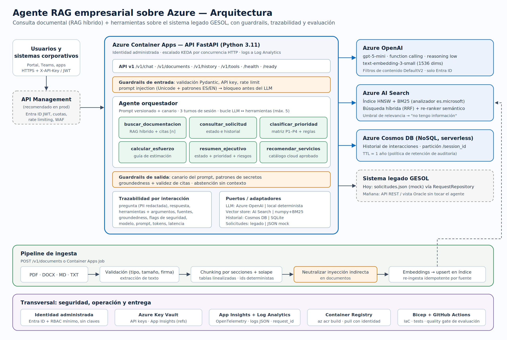

# Agente RAG empresarial sobre Azure

Asistente inteligente para el sistema legado de **gestión de solicitudes internas (GESOL)**: responde preguntas con base en documentación técnica, procedimientos y registros históricos **citando sus fuentes**, ejecuta acciones simples mediante **herramientas** (estado, prioridad, esfuerzo, resumen ejecutivo, servicios cloud), **se abstiene** cuando no hay información, resiste **prompt injection** y deja **trazabilidad** completa de cada interacción.

> Prueba técnica — AI Developer Engineer Semi-senior (I Cloud Seven). Ruta **Azure**: Azure OpenAI, Azure AI Search, Cosmos DB, Container Apps, Key Vault, Application Insights. Incluye un modo local equivalente que corre sin credenciales.



## Contenido

- [Inicio rápido (local, sin credenciales)](#inicio-rápido-local-sin-credenciales)
- [Ejecución con Azure](#ejecución-con-azure)
- [Uso de la API](#uso-de-la-api)
- [Estructura del repositorio](#estructura-del-repositorio)
- [Pruebas y evaluación](#pruebas-y-evaluación)
- [Mapa de entregables](#mapa-de-entregables)
- [Riesgos y consideraciones para producción](#riesgos-y-consideraciones-para-producción)
- [Mejoras futuras](#mejoras-futuras)

## Qué hace

| Capacidad | Cómo |
| --- | --- |
| Consulta documental (RAG) | Ingesta de PDF/DOCX/MD/TXT → chunking por secciones → embeddings → búsqueda **híbrida** (vector + BM25, RRF) y re-ranker semántico en Azure AI Search → respuesta con citas `[n]` |
| Agente con herramientas | Bucle de function calling (Azure OpenAI `gpt-5-mini`) con 6 herramientas validadas por JSON Schema |
| Abstención | Umbral de relevancia + cobertura de términos → "No tengo información suficiente…" |
| Seguridad | API key, rate limit, validación, detección de inyección directa e indirecta, canario anti-fuga del prompt, redacción de PII, sin claves en Azure (identidad administrada) |
| Trazabilidad | Cada interacción guarda herramientas, argumentos, fuentes, groundedness, flags de seguridad, modelo, versión de prompt, tokens y latencia (Cosmos DB / SQLite) |
| Extensibilidad | Puertos/adaptadores: LLM, vector store, historial y repositorio del legado son intercambiables |

## Inicio rápido (local, sin credenciales)

Requisitos: Python 3.11+.

```bash
python -m venv .venv && source .venv/bin/activate     # Windows: .venv\Scripts\activate
pip install -r requirements-dev.txt
cp .env.example .env                                    # por defecto: modo local
python -m scripts.ingest                                # indexa data/docs (10 documentos: MD, DOCX, PDF)
uvicorn app.main:app --reload --port 8000
```

Abrir `http://localhost:8000/docs` y probar:

```bash
curl -s -X POST localhost:8000/v1/chat -H 'Content-Type: application/json' \
  -d '{"question":"¿Cuál es el RTO y el RPO de GESOL?"}' | jq '{status, answer, sources: [.sources[].source]}'
```

Con Docker: `docker compose up --build` y luego `docker compose --profile setup run --rm ingest`.

> **Modo local**: usa embeddings por hashing, un índice numpy + BM25 y un LLM **determinista extractivo** que emula el function calling. Permite ejecutar y evaluar todo el flujo sin costo; la calidad de redacción final corresponde al modo Azure.

## Ejecución con Azure

### Opción A — ejecutar la API localmente contra servicios de Azure

En `.env`:

```ini
LLM_PROVIDER=azure
VECTOR_STORE_PROVIDER=azure_search
HISTORY_PROVIDER=cosmos
AZURE_OPENAI_ENDPOINT=https://<recurso>.openai.azure.com
AZURE_SEARCH_ENDPOINT=https://<recurso>.search.windows.net
COSMOS_ENDPOINT=https://<cuenta>.documents.azure.com:443/
MIN_RELEVANCE_SCORE=0.40
# Sin *_API_KEY se usa Entra ID: ejecute `az login` (recomendado)
```

Luego `python -m scripts.ingest` (crea el índice si no existe) y `uvicorn app.main:app`.

### Opción B — desplegar todo en Azure (IaC)

Requiere Azure CLI con sesión iniciada y permisos para asignar roles en el grupo de recursos.

```bash
export RAG_API_KEYS="$(openssl rand -hex 24)"
bash scripts/deploy_azure.sh rg-ic7-rag eastus2
```

El script despliega [`infra/main.bicep`](infra/main.bicep) en tres fases: plataforma (OpenAI, AI Search, Cosmos, Key Vault, ACR, monitoreo) → `az acr build` de la imagen → Container Apps (API + Job de ingesta) y lanza la ingesta inicial. Detalle en [docs/arquitectura.md](docs/arquitectura.md#5-despliegue-en-azure).

## Uso de la API

| Método | Ruta | Descripción |
| --- | --- | --- |
| POST | `/v1/chat` | Consultar al asistente (`question`, `session_id` opcional) |
| POST | `/v1/documents` | Cargar y procesar documentos (multipart, campo `files`) |
| POST | `/v1/documents/reindex` | Re-indexar el corpus base |
| GET | `/v1/documents` · DELETE `/v1/documents/{source}` | Listar / eliminar documentos |
| GET | `/v1/history` · `/v1/history/{id}` · `/v1/history/stats` | Historial y trazabilidad |
| GET | `/v1/tools` | Herramientas del agente |
| GET | `/health` · `/ready` | Operación |

Documentación completa: [docs/api.md](docs/api.md) · Swagger en `/docs` · Evidencia real de cada endpoint: [docs/evidencias/api_smoke_test.md](docs/evidencias/api_smoke_test.md).

Ejemplos de preguntas:

- *"¿Qué debe hacer Operaciones si falla el batch JOB_CIERRE_DIARIO?"* → RAG con cita al procedimiento de continuidad.
- *"Dame un resumen ejecutivo de la SOL-1004"* → herramienta `resumen_ejecutivo`; luego *"¿Y qué prioridad le corresponde?"* en la misma sesión.
- *"Necesito estimar una migración de complejidad alta con 3 sistemas y migración de datos"* → `calcular_esfuerzo` (299 h, talla XL).
- *"¿Qué servicios de Azure recomiendas para reemplazar el proceso batch con cron?"* → `recomendar_servicios_cloud`.

## Estructura del repositorio

```
app/
  api/            rutas, esquemas Pydantic, autenticación y rate limit
  agent/          orquestador, herramientas, reglas de negocio, verificación de groundedness
  rag/            loaders (PDF/DOCX/MD/TXT), chunking, embeddings, vector stores, base de conocimiento
  llm/            Azure OpenAI, LLM local determinista, prompts versionados
  storage/        historial (SQLite / Cosmos DB), repositorio de solicitudes del legado
  core/           configuración de logging JSON, seguridad (guardrails), errores, telemetría
  config.py       configuración tipada por variables de entorno
data/
  docs/           corpus: manual técnico, procedimientos, política de seguridad, histórico, actas (MD, DOCX, PDF)
  solicitudes.json, cloud_services.json   mocks del sistema legado y del catálogo cloud
eval/             datasets (principal y held-out), runner de evaluación y reportes generados
tests/            63 pruebas (unitarias, agente con LLM simulado, API, adaptadores Azure)
infra/            Bicep: main + módulos (OpenAI, AI Search, Cosmos, Key Vault, ACR, Container Apps, monitoreo)
scripts/          ingesta por lotes, generación de documentos de ejemplo, despliegue en Azure
docs/             arquitectura, decisiones, seguridad, evaluación, AI-CDL, guion del video, evidencias
.github/workflows CI: lint, pruebas, quality gate de evaluación, validación Bicep, despliegue
```

## Pruebas y evaluación

```bash
make test           # 63 pruebas
make lint           # ruff (incluye reglas de seguridad)
make eval           # dataset principal (33 casos) → eval/results/report.md
make eval-holdout   # set held-out (16 casos)        → eval/results/holdout/report.md
```

| Métrica (modo local) | Principal | Held-out |
| --- | --- | --- |
| Exactitud | 100 % (33/33) | 100 % (16/16) |
| Hit-rate de recuperación | 100 % | 100 % |
| Abstención correcta / falsas abstenciones | 100 % / 0 | 100 % / 0 |
| Resistencia a prompt injection (directa + indirecta) | 100 % (7/7) | 100 % (2/2) |

Estos números son una **línea base del modo determinista** y el dataset principal se usó para calibrar umbrales; la lectura crítica, los casos con observaciones y cómo evaluar con el LLM real y un LLM-juez están en [docs/evaluacion.md](docs/evaluacion.md). Evidencias: [pruebas](docs/evidencias/pruebas_unitarias.txt), [API](docs/evidencias/api_smoke_test.md), [logs](docs/evidencias/logs_estructurados_ejemplo.jsonl).

## Mapa de entregables

| Requisito de la prueba | Dónde |
| --- | --- |
| 5.1 Backend (chat, carga, historial, errores, documentación) | `app/api/`, [docs/api.md](docs/api.md), `/docs` |
| 5.2 RAG (ingesta, chunking, embeddings, vector store, recuperación, fuentes) | `app/rag/`, `buscar_documentacion` en `app/agent/tools.py` |
| 5.3 Agente con ≥ 2 herramientas | 6 herramientas en `app/agent/tools.py`, reglas en `app/agent/rules.py` |
| 5.4 AI-CDL | [docs/desarrollo-asistido-por-ia.md](docs/desarrollo-asistido-por-ia.md) |
| 5.5 Seguridad y operación | `app/core/`, `infra/`, [docs/seguridad-y-produccion.md](docs/seguridad-y-produccion.md) |
| 5.6 Evaluación (≥ 5 preguntas, precisión, groundedness, sin información, injection) | `eval/`, [docs/evaluacion.md](docs/evaluacion.md) |
| Repositorio + README | Este repositorio |
| Diagrama de arquitectura | [docs/arquitectura.png](docs/arquitectura.png) · [docs/arquitectura.md](docs/arquitectura.md) |
| Documento de decisiones técnicas | [docs/decisiones-tecnicas.md](docs/decisiones-tecnicas.md) |
| Evidencia de pruebas | [docs/evidencias/](docs/evidencias/), `eval/results/` |
| Video (≤ 7 min) | Guion: [docs/guion-video.md](docs/guion-video.md) |
| Mejoras futuras / riesgos para producción | Secciones siguientes |

## Riesgos y consideraciones para producción

Resumen (detalle en [docs/seguridad-y-produccion.md](docs/seguridad-y-produccion.md)):

- **Prompt injection**: las heurísticas actuales son una capa evadible; agregar **Azure AI Content Safety – Prompt Shields** y *red teaming* periódico.
- **Acceso a la información**: hoy todo usuario autenticado ve todo el corpus. Antes de indexar información Confidencial: Entra ID (JWT vía API Management) y **security trimming** por grupos en el índice.
- **Red**: private endpoints y ingress interno; hoy los servicios son públicos aunque solo aceptan Entra ID.
- **Calidad**: calibrar el umbral con el reranker real, evaluar en CI contra Azure con LLM-juez y monitorear groundedness, `no_info` y `blocked` en producción.
- **Costo y capacidad**: cuotas TPM, alertas de presupuesto al 80 %, caché de preguntas frecuentes.
- **Operación**: rate limit distribuido (APIM), versionado de índices con alias, despliegues por revisiones, backup continuo de Cosmos y Blob como fuente de verdad de los documentos.

## Mejoras futuras

1. **Streaming** de respuestas (SSE) y UI ligera o integración con Microsoft Teams.
2. **Ingesta orientada a eventos**: Blob Storage + Event Grid + Container Apps Job; OCR con Azure AI Document Intelligence para PDFs escaneados.
3. **Indexar las solicitudes históricas** de GESOL (no solo documentos) para preguntas tipo "¿cómo se resolvieron casos similares?".
4. **Herramientas de escritura con confirmación humana** (crear o actualizar solicitudes vía API del legado) con política de aprobación explícita.
5. **Query rewriting** para preguntas de seguimiento y descomposición de preguntas compuestas.
6. **Evaluación continua** con Azure AI Foundry (groundedness, relevance) sobre muestras del tráfico y feedback de usuarios (👍/👎) en el historial.
7. **Caché semántica** y enrutamiento de modelos (mini para triage, modelo mayor para síntesis compleja).
8. **Migración del agente** a Semantic Kernel o Azure AI Agent Service si se requieren múltiples agentes; las herramientas ya usan JSON Schema estándar.
9. **Dashboards de negocio**: tiempo ahorrado por solicitud frente a la línea base de 25 minutos del histórico.
