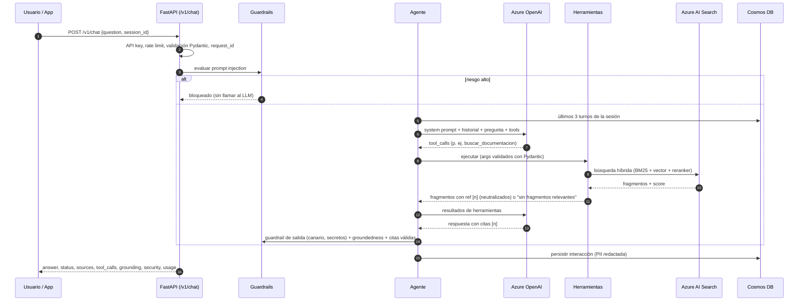
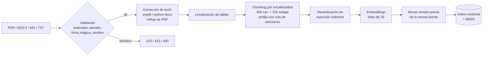

# Arquitectura

> Fuente editable: [`arquitectura.svg`](arquitectura.svg). Los diagramas de secuencia de abajo están en Mermaid (GitHub los renderiza).

## 1. Vista general

La solución es **una sola API FastAPI** desplegada en **Azure Container Apps** que orquesta:

| Capa | Responsabilidad | Implementación Azure | Implementación local |
| --- | --- | --- | --- |
| API | Contratos HTTP, validación, auth, rate limit, errores | Container Apps (+ API Management en prod) | `uvicorn` |
| Agente | Bucle LLM ↔ herramientas, memoria de sesión, guardrails | Azure OpenAI `gpt-5-mini` (function calling) | `LocalLLM` determinista |
| RAG | Ingesta, chunking, embeddings, búsqueda híbrida, citas | Azure OpenAI `text-embedding-3-small` + Azure AI Search (híbrida + semántica) | Embeddings por hashing + numpy + BM25 (RRF) |
| Herramientas | Reglas de negocio auditables sobre solicitudes | Mismo código | Mismo código |
| Trazabilidad | Registro completo de cada interacción | Cosmos DB (serverless, TTL 1 año) | SQLite |
| Observabilidad | Logs JSON correlacionados, trazas | Application Insights + Log Analytics | stdout JSON |
| Secretos | API keys, cadenas | Key Vault + identidad administrada | `.env` (no versionado) |

El diseño sigue **puertos y adaptadores**: el agente, las herramientas y el RAG no saben si hablan con Azure o con la implementación local. Eso permite ejecutar toda la solución y sus 63 pruebas **sin credenciales**, y desplegar en Azure cambiando solo variables de entorno.

## 2. Flujo de una pregunta

## 3. Flujo de ingesta

## 4. Decisiones de diseño clave (resumen)

- **RAG como herramienta del agente**, no como paso fijo: el agente decide si necesita documentos, datos de una solicitud o ambos. Detalle en [decisiones técnicas](decisiones-tecnicas.md).
- **Reglas de negocio en código, no en el LLM**: prioridad y esfuerzo se calculan con funciones deterministas alineadas con los documentos (`app/agent/rules.py`). El LLM solo decide *cuándo* usarlas y explica el resultado.
- **Abstención explícita**: si ningún fragmento supera el umbral de relevancia, la herramienta devuelve "sin fragmentos relevantes" y el agente responde que no tiene información.
- **Trazabilidad de extremo a extremo**: `request_id` en logs y cabeceras + registro persistente con herramientas, argumentos, fuentes, groundedness, versión del prompt, modelo, tokens y latencia.

## 5. Despliegue en Azure

Infraestructura como código en [`infra/`](../infra) (Bicep, compila y pasa `bicep lint` sin advertencias):

| Recurso | Configuración destacada |
| --- | --- |
| Identidad administrada (user-assigned) | Única identidad de la app; roles mínimos por recurso |
| Azure OpenAI | `disableLocalAuth: true`, `gpt-5-mini` GlobalStandard (gpt-4o-mini ya no se puede desplegar en suscripciones nuevas), `text-embedding-3-small`, política de contenido `DefaultV2` |
| Azure AI Search (Basic) | `disableLocalAuth: true`, semantic ranker `free`, índice creado por la app |
| Cosmos DB | Serverless, `disableLocalAuth: true`, partición `/session_id`, TTL 1 año, rol de datos built-in |
| Key Vault | RBAC, purge protection, secretos referenciados desde Container Apps |
| Container Registry | Sin usuario admin, `AcrPull` para la identidad |
| Container Apps | API (1–5 réplicas, escala por concurrencia), probes `/health` y `/ready`, Job manual de ingesta |
| Log Analytics + App Insights | Logs de contenedores + OpenTelemetry |

Script de punta a punta: [`scripts/deploy_azure.sh`](../scripts/deploy_azure.sh) (plataforma → `az acr build` → apps → job de ingesta).
